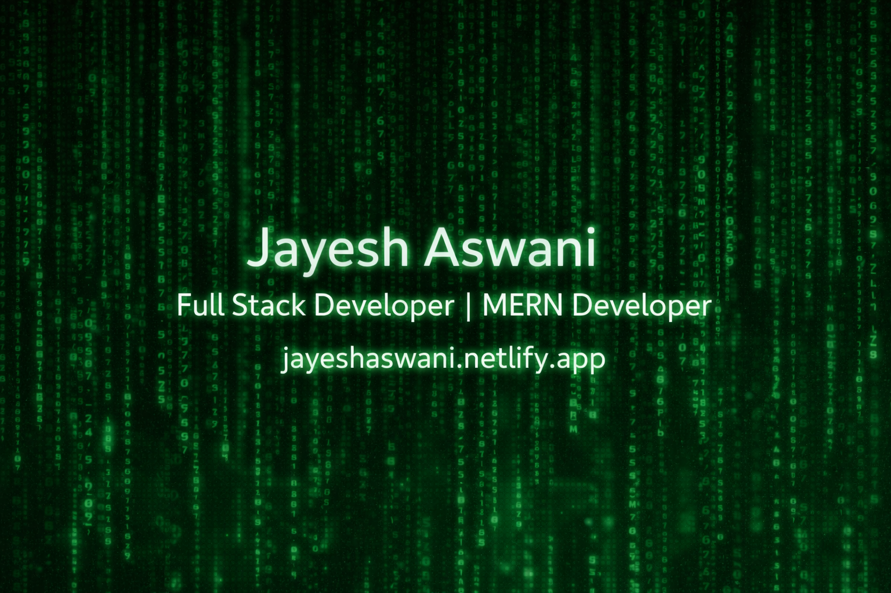

<!-- Banner Placeholder (Matrix Theme) -->

  

<!-- Typing Intro -->

  

---

### 👋 **About Me**

I am a full stack developer focused on delivering smooth, clean, and scalable web experiences.  
I love UI, I love logic, and I love making things **feel fast**.

---

### 🚀 **Portfolio**
🔗 https://jayeshaswani.netlify.app

---

### 🧠 **Current Focus**
- Improving backend architecture
- Building stronger UI/UX
- Learning automation & AI tools
- Expanding MERN stack knowledge

---

### 🛠 **Tech Stack**

#### **Frontend**
<code></code>
<code></code>
<code></code>
<code></code>
<code></code>
<code></code>

#### **Backend**
<code></code>
<code></code>

#### **Database**
<code></code>

#### **Other Languages**
<code></code>
<code></code>
<code></code>

---

### 📊 **GitHub Stats**

---

### 🌱 **Contribution Graph**

---

### 🤝 **Connect With Me**
📧 Email: **jayeshaswani@gmail.com**  
🌐 Portfolio: **jayeshaswani.netlify.app**

---

Thanks for visiting! 🚀

